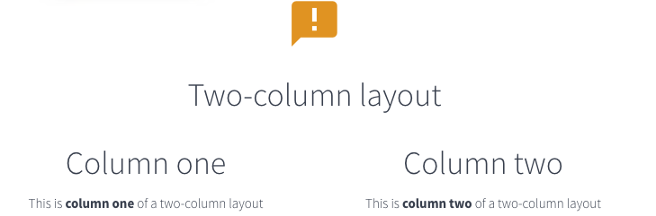
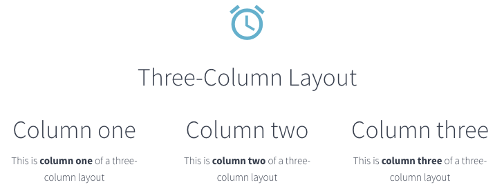

# X-Risk Content Management System

The **X-Risk Content Management System (CMS)** allows content pages to be edited through a user-friendly user interface, making it easy for non-technical users to make content changes to the X-Risk website. 

**X-Risk CMS** runs on **Python Wagtail** (http://wagtail.io), providing close integration with Python Django, the framework used for the TERRA assessment system. The **X-Risk CMS** uses the same external design template as the main TERRA application.

For general user instructions on how to use Wagtail CMS, go to:  
https://docs.wagtail.io/en/v2.8/editor_manual/index.html

## Setting up
The **X-Risk CMS** system, including a number of X-Risk content pages, will be installed during the set up of the main TERRA application. A *superuser* will be created during the setup phase and this user account provides full access to the content within the CMS.

## Logging in
To log into the **X-Risk CMS** of your TERRA website, go to:  

http://yourdomain.com/cms

Where `yourdomain.com` is the website where you have installed TERRA. Enter your *superuser* username and password to access the CMS content pages. 

## X-Risk CMS structure

The **X-Risk CMS** provides two different page content types:

### Home page
The `Home page` page type provides support for image carousels, multi-column layouts, lists of other pages, random lists of latest publications, and raw HTML. There is currently one instance of a `Home page` page on the X-Risk website which includes an image carousel and a random list of latest publications.

### Standard page
The `Standard page` page type is the default page type used for the majority of content pages of X-Risk.

For both page types, it's possible to create multiple rich text fields with default styling options such as bold, italic, superscript, subscript, headlines, anchor tags, as well as add in images. It is also possible to reorder the position of fields by clicking the up and down arrows on the top-right corner of each field. It is, however, not possible to add a raw HTML section into a `Standard page`. 

## Home page content

### Image carousels
You can add one or more carousels items to a `Home page` by clicking on the `Carousel items` area of the page and selecting `Add carousel items`. Then select or upload an image, add in the main text, subtext and a relevant link for the carousel item, and click `Publish`.

### Multi-column layouts
You can add both two-column and three-column layouts to a `Home page`. A two-column layout will look like:

A three-column layout will look like:

To create a multi-column layout, scroll to the bottom of the `Body` section within a `Home page`, click `+` and add a `Row` section. Then add two `Half column` sections or three `Third column` sections. 

Add in appropriate content for each column. You can set the icon for each row or column by entering a **Material design** name for the icon. A full list of **Material design** icons can be found at:  

https://material.io/resources/icons/

To use the `announcement` icon for example, enter `announcement` into the `Icon` field within `Row` or `Column`. You can specify the colour of the icon by adding a colour descriptor from the following list into the `Icon colour` field:  

- `default`
- `primary`
- `info`
- `success`
- `warning`
- `danger`
- `rose`

### Lists of other pages 
To create a list of pages on a `Home page`, such as a list of news stories or events, begin by creating a `Standard page` for each separate item of content, eg. each news story or event. 

For each `Standard page`, go to the `Promote` tab of the page, scroll down to the `Tags` section and add in the name of an appropriate tag, eg. `news` or `event`, followed by a comma (or select from the tag that pops up). You can add in multiple tags, eg. `news` and `researchnews`. Click `Publish` to save changes for each page.

Add a **feed image** to a page - to appear alongside the page title when the page is listed - by going to `Promote`, scrolling down to `Feed image` and selecting or uploading an image.

After you have created the content you want to list, go to a `Home page`, scroll to the bottom of the `Body` section and click `+` to select a `Tagged articles` section. Enter the tag name of the pages you would like listed, eg. `news`. Click `Publish` and the relevant tagged pages will be displayed where you placed the `Tagged articles` section.

### List of recent publications

To create a list of recent publications on a `Home page`, scroll to the bottom of the `Body` section of the page and click `+` to select a `Tagged articles` section. Enter the text `recent_publications`. Click `Publish`. A random list of recent publications will be displayed on the `Home page` where you placed the `Tagged articles` section.

### Raw HTML

To add a section of raw HTML, scroll to the bottom of the `Body` section on a `Home page` and click `+` to select a `Raw HTML` section. Enter the raw HTML and click `Publish` to save changes.

## General points on adding content

### Enabling menu items
To add a page to the main menu, ensure the page has `Show in menus` enabled under the `Promote` tab. Then go to `Settings -> Main Menu` to create a menu item for the specific page. 

